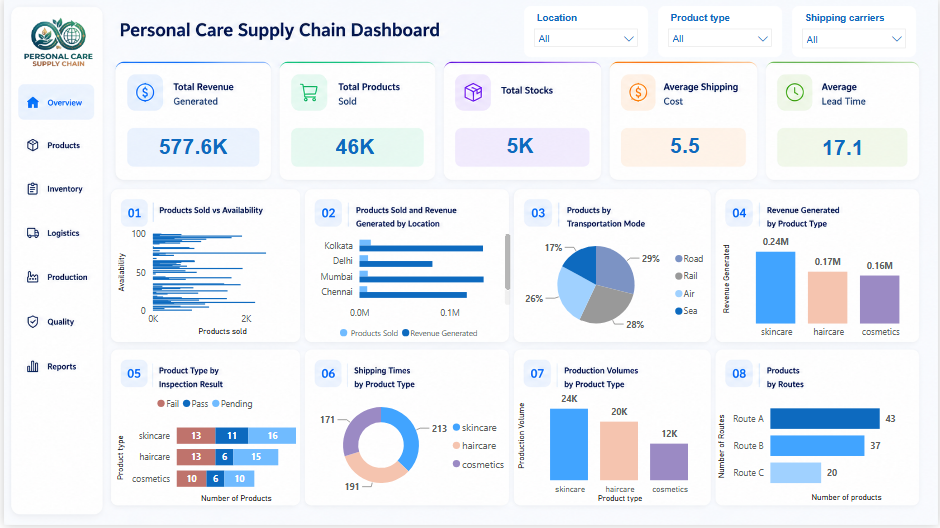

# Personal Care Supply Chain Analysis Dashboard

Interactive analytics dashboard analyzing a 100-SKU supply chain dataset across three personal care
categories (haircare, skincare, cosmetics) in five Indian cities — from manufacturing and quality
inspection through to warehousing, shipping, and final sale.



## Key Numbers

| KPI | Value |
|---|---|
| Total Revenue Generated | $577,604.8 |
| Total Products Sold | 46,099 units |
| Total Stocks | 4,777 units |
| Average Shipping Costs | $5.55 / unit |
| Average Lead Time (procurement) | 17.1 days |

**Headline finding:** only **23%** of SKUs have a confirmed quality pass — 41% are still pending
and 36% failed inspection outright. Every revenue and volume figure above should be read against
that quality gap.

## Data Model — Star Schema

- **Fact_SupplyChain** (grain: 1 row per SKU) — revenue, units sold, stock, shipping/production/
  manufacturing measures, defect rate, costs
- **7 dimension tables**, each with a surrogate key: `Dim_ProductType`, `Dim_Location`,
  `Dim_Supplier`, `Dim_Carrier`, `Dim_Route`, `Dim_TransportMode`, `Dim_InspectionResult`,
  `Dim_CustomerDemographics`

A single fact table with flat, low-cardinality dimensions — a Star schema was used deliberately
over Snowflake/Galaxy since there's no hierarchy to normalize and no second business process to
justify a second fact table.

## Charts (8, per task spec)

1. Products Sold vs Availability (distribution)
2. Products Sold & Revenue Generated by Location
3. Products by Transportation Mode (pie)
4. Revenue Generated by Product Type
5. Product Type by Inspection Result
6. Shipping Times by Product Type
7. Production Volumes by Product Type
8. Products by Routes

Full measure list and logic: [`docs/DAX_Measures.md`](docs/DAX_Measures.md)

## Report

Full written analysis with findings, data limitations, and recommendations:
[`Supply_Chain_Analysis_Report.pdf`](Supply_Chain_Analysis_Report.pdf)

## Tech Stack

Power BI Desktop · Power Query (M) · DAX · Excel (source data)

## Files

```
├── Personal_Care_Supply_Chain_Dashboard.pbix
├── Supply_Chain_Analysis_Report.pdf
├── data/supply_chain_data.xlsx
├── screenshots/dashboard_overview.png
└── docs/DAX_Measures.md
```

---
Built by **Ahmed Elsayed** — Data Analyst & BI Developer
[LinkedIn](https://linkedin.com/in/ahmed-elsayed77) · [GitHub](https://github.com/AhmedElsayed77)
